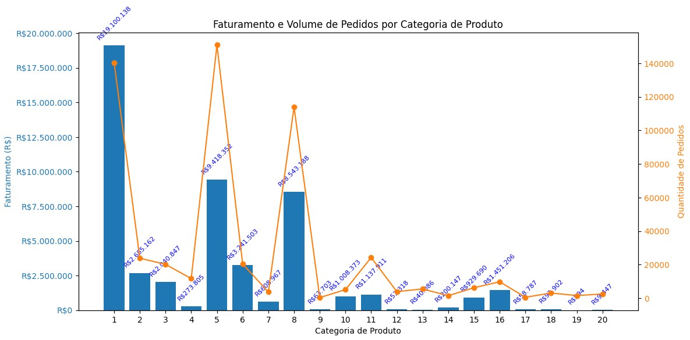

# E-commerce Sales Analysis – Portfolio Project

## Overview
This project analyzes an extensive e-commerce sales dataset to uncover key customer patterns, product performance, and actionable business opportunities. The analysis leverages PySpark/SQL for scalable data handling and aims to provide insights that drive marketing strategy, segmentation, and growth.

## Project Structure
The work is divided into two main phases:
1. **Exploratory Data Analysis (EDA):**  
   - Profiling sales, users, average ticket per segment
   - Identifying top products, user metrics, sales by age
   - Answering core business questions for baseline understanding

2. **Deep-Dive Analysis:**  
   - Segmenting customers to target high-value audiences
   - Analyzing product category performance
   - Recommending data-driven marketing and sales strategies for the next campaign

## Key Findings
- **Target Audience Identified:**  
  Single users aged 26–35 are the most valuable segment, responsible for nearly 40% of Black Friday revenue.
- **Volume vs. Profit:**  
  - Category 5 leads in sales volume but only generates 18% of revenue.
  - Category 1 leads in profitability, with 25% of orders but 37% of total revenue.
- **Product Recommendations:**  
  Focus next campaign on the top products from Category 1: P00025442, P00110742, and P00184942.
- **Strategy:**  
  Use Category 5 as a volume entry point, but prioritize Category 1 for profit. Target marketing on single 26–35 year-olds.

## Technologies Used
- PySpark, SQL (advanced analytics)
- Google Colab (notebook environment)
- Pandas, Matplotlib, Seaborn (visualization)

## Sample Visuals
Revenue and Order Volume by Category

## How to Reproduce
- Open the notebook with Google Colab.
- Upload `dados.zip` when prompted in the notebook. The script will unzip and load the JSON files.
- Run each cell sequentially to process and analyze the data.

## Documentation
- [View Notebook](e_commerce_sales_analysis_alex_vechi.ipynb)

## Contact
- [LinkedIn](https://linkedin.com/in/alexandre-vechi-maciel)
- Email: [alexandre.vechim@gmail.com](mailto:alexandre.vechim@gmail.com)
